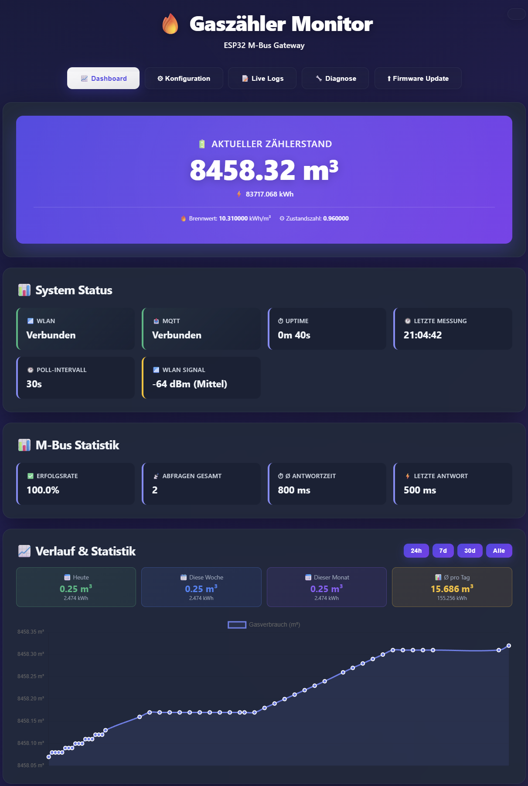

# 🏭 BK-G4AT2MQTT - ESP32 Gaszähler Gateway

> **Original Projekt von [BennoB666](https://github.com/BennoB666/BK-G4AT2MQTT)**  
> Dieser Fork wurde massiv erweitert mit professioneller WebUI, Live-Monitoring und umfangreichen Features.

Ein leistungsstarkes ESP32 Gateway zum Auslesen der M-Bus Schnittstelle eines **Honeywell BK-G4AT Gaszählers** mit vollständiger MQTT Integration und moderner Web-Oberfläche.

[](https://github.com/YOUR-USERNAME/BK-G4AT2MQTT/releases)
[](https://www.espressif.com/en/products/socs/esp32)
[](https://www.arduino.cc/)
[](https://mqtt.org/)
[](https://www.home-assistant.io/)
[](https://www.chartjs.org/)

---

## 📑 Inhaltsverzeichnis

- [Features](#-features)
- [Hardware Setup](#-hardware-setup)
- [Installation](#-installation)
- [WebUI Übersicht](#-webui-übersicht)
- [Home Assistant Integration](#-home-assistant-integration)
- [Konfiguration](#-konfiguration)
- [OTA Updates](#-ota-updates)
- [Technische Details](#-technische-details)

---

## ✨ Features

### 🎨 Moderne Web-Oberfläche

**Glasmorphism Design** mit Dark/Light Mode

- **Dashboard**
  - Live-Anzeige: Gasverbrauch (m³) und Energie (kWh)
  - **Interaktiver Chart.js Verlaufs-Chart**
    - Zeitachsen mit Auto-Skalierung
    - Zoom & Pan Funktionen
    - Zeitbereiche: 24h, 7 Tage, 30 Tage, Alle
    - Responsive Tooltips mit deutschen Datumsformaten
    - Smooth Linien mit Gradientenfillung
  - System-Status (WiFi, MQTT, Uptime)
  - M-Bus Statistiken & Erfolgsrate
  - Letzte Messungen Historie

- **Konfiguration**
  - WiFi & MQTT Einstellungen über WebUI
  - Brennwert & Z-Zahl Konfiguration
  - Poll-Intervall (10-3600s)
  - Statische IP (optional)
  - Keine Code-Änderungen nötig!

- **Live Logs** ⭐ NEU in v2.0
  - Echtzeit-Logging aller Ereignisse
  - **Hex-Dump** der M-Bus Rohdaten für Debugging
  - **Detaillierte Berechnungsanzeige** (Zählerstand, Brennwert, Z-Zahl)
  - Farbcodiert nach Typ (ESP, MQTT, M-Bus)
  - Icons für Status (✓ ❌ ⚠)
  - Auto-Refresh alle 3 Sekunden
  - Beispiel:
    ```
    M-Bus: Rohdaten - 68 1F 1F 68 08 00 72 43 53 69 26...
    MQTT: Energie - 83763.2 kWh (Zählerstand: 8451.83 m³, Brennwert: 10.36, Z-Zahl: 0.9607)
    ```

- **Netzwerk-Diagnose**
  - MQTT Verbindungstest
  - WiFi Signal & Qualität
  - Gateway Ping Test
  - **M-Bus Statistiken** mit durchschnittlicher Antwortzeit
  - **Fehlerstatistik-Reset** Button (löscht Fehlerzähler)
  - **System-Informationen** (Heap, Flash, Chip-Modell)
  - CSV Export der Historie

- **Firmware Update**
  - OTA via PlatformIO
  - Anleitung mit aktueller IP
  - USB-Fallback Option

### 🏠 Home Assistant Integration

- **MQTT Auto-Discovery** - Automatische Erkennung ohne YAML
- **5 Sensoren** werden automatisch angelegt:
  - `sensor.esp32_gaszaehler_zaehlerstand` - Gasverbrauch (m³)
  - `sensor.esp32_gaszaehler_gasverbrauch` - Energie (kWh) für Energy Dashboard
  - `sensor.esp32_gaszaehler_wifi` - WiFi Signal (dBm)
  - `sensor.esp32_gaszaehler_mbus` - M-Bus Erfolgsrate (%)
  - `binary_sensor.esp32_gaszaehler_online` - Verfügbarkeitsstatus
- **Energy Dashboard** kompatibel (`state_class: total_increasing`)
- **Availability Tracking** mit Last Will Testament
- **Brennwert-Berechnung** - Automatische kWh Konvertierung
- **Gerät im MQTT Device Registry** mit allen Sensoren gruppiert

### 📊 Erweiterte Energie-Funktionen

- **Brennwert-Umrechnung** (m³ → kWh)
- **Z-Zahl Korrekturfaktor** für präzise Messungen
- **Konfigurierbar** über WebUI (Standard: 10.0 kWh/m³)
- **Separate MQTT Topics** für Volumen und Energie
- **Persistente Speicherung** von bis zu 50 Messungen

## 🔌 Hardware Setup

### Benötigte Komponenten

- **ESP32 DevKit V1** (empfohlen) oder ESP32-C3
- **M-Bus Interface** (5V, UART)
- **Honeywell BK-G4AT** Gaszähler mit M-Bus / ENCODER

### Verkabelung


| ESP32 Pin | M-Bus Interface | Beschreibung |
|-----------|-----------------|--------------|
| **TX2** (GPIO17) | TX | UART Transmit |
| **RX2** (GPIO16) | RX | UART Receive |
| **GND** | GND | Masse |
| **5V** | VCC | Spannungsversorgung |

**Hinweis:** GPIO16/17 = UART2, Baudrate: 2400, 8E1 (8 Data, Even Parity, 1 Stop)

---

## 🚀 Installation

### 1. PlatformIO einrichten

```bash
# Repository klonen
git clone https://github.com/YOUR-USERNAME/BK-G4AT2MQTT.git
cd BK-G4AT2MQTT

# Dependencies werden automatisch installiert
pio run
```

### 2. Firmware flashen (USB)

```bash
# Kompilieren und Upload
pio run -t upload

# Mit Serial Monitor
pio run -t upload -t monitor
```

### 3. Erstkonfiguration (Access Point)

Nach dem ersten Flash:

1. **ESP32 startet im AP-Modus**
   - LED blinkt sehr schnell (100ms)
   - SSID: `ESP32-GasZaehler` erscheint

2. **Mit AP verbinden**
   - Passwort: `12345678`
   - Automatische IP: `192.168.4.1`

3. **WebUI öffnen**
   - Browser: `http://192.168.4.1`
   - **Konfiguration** Tab öffnen

4. **Einstellungen eingeben**
   ```
   WiFi:
   ├─ SSID: [Ihr WLAN Name]
   ├─ Passwort: [Ihr WLAN Passwort]
   └─ Hostname: ESP32-GasZaehler
   
   MQTT:
   ├─ Server: [MQTT Broker IP]
   ├─ Port: 1883
   ├─ Username: (optional)
   ├─ Passwort: (optional)
   └─ Topic: gaszaehler/verbrauch
   
   Gas-Konfiguration:
   ├─ Brennwert: 10.0 kWh/m³
   ├─ Z-Zahl: 1.0
   └─ Poll-Intervall: 60 Sekunden
   ```

5. **Speichern & Neustart**
   - ESP32 startet neu
   - Verbindet sich mit WLAN
   - IP-Adresse in Serial Console / Logs

6. **Zugriff über WLAN**
   - `http://[ESP32-IP]` oder
   - `http://ESP32-GasZaehler.local` (mDNS)

---

## 🌐 WebUI Übersicht

### Dashboard (`http://[ESP32-IP]`)



### Live Logs

```
[14:32:15] (1245s) 🚀 ESP32 Boot - System Start
[14:32:16] (1246s) 📶 WiFi verbunden: 10.10.40.109
[14:32:17] (1247s) 🔗 MQTT: Verbunden!
[14:32:45] (1275s) 📡 M-Bus: Poll gestartet
[14:32:47] (1277s) 📡 M-Bus: Antwort erhalten (42 Bytes, 156ms)
[14:32:47] (1277s) 📡 M-Bus: Rohdaten - 68 1F 1F 68 08 00 72 43 53 69...
[14:32:47] (1277s) 📡 M-Bus: Verbrauch OK - 1234.56 m³
[14:32:48] (1278s) 🔗 MQTT: Energie - 12345.6 kWh (Zählerstand: 1234.56 m³, Brennwert: 10.0, Z-Zahl: 1.0)
```

**API Endpoints:**
- `GET /api/diagnostics` - M-Bus Statistiken als JSON
- `POST /api/errors/reset` - Fehlerstatistik zurücksetzen
- `POST /api/mbus/trigger` - Manuelle M-Bus Abfrage triggern

---

### MQTT Topics

| Topic | Beschreibung | Wert | Einheit |
|-------|--------------|------|---------|
| `gaszaehler/verbrauch` | Gasvolumen | `1234.56` | m³ |
| `gaszaehler/verbrauch_energy` | Energie | `12345.6` | kWh |
| `gaszaehler/verbrauch_wifi` | WiFi Signal | `-45` | dBm |
| `gaszaehler/verbrauch_mbus_rate` | M-Bus Rate | `98.5` | % |
| `gaszaehler/availability` | Status | `online`/`offline` | - |

**Hinweis:** Topics sind über WebUI Konfiguration änderbar (Base Topic: `gaszaehler/verbrauch`)

---

## 👏 Credits & Danksagung

**Original Projekt:**  
[BennoB666/BK-G4AT2MQTT](https://github.com/BennoB666/BK-G4AT2MQTT) - Vielen Dank für das Basis-Projekt!

**Fork Maintainer:**  
Erweitert mit WebUI, Live-Monitoring, Energy Dashboard Integration und vielen weiteren Features.

**Libraries:**
- [PubSubClient](https://github.com/knolleary/pubsubclient) - MQTT Client
- [ESP32Ping](https://github.com/mobizt/ESP32-Ping) - ICMP Ping
- Arduino ESP32 Core Team

---

## 🔧 Unterstützte Boards

- **ESP32 DevKit V1** (empfohlen) - `board = esp32dev`
- **ESP32-C3 DevKit** - `board = esp32-c3-devkitm-1`

Anpassung in `platformio.ini`:
```ini
[env:esp32dev]
platform = espressif32
board = esp32dev
framework = arduino
```

---

## 🛠️ Fehlersuche

### WebUI Fehlerstatistik
Öffnen Sie das Dashboard → "Fehlerstatistik" zeigt:
- M-Bus Timeouts
- Parse-Fehler
- MQTT Verbindungsfehler
- WLAN Trennungen
- Letzter Fehler mit Beschreibung

### Serial Monitor
- Baudrate: **115200**
- Detailliertes Logging aller Aktionen
- AP-Modus Details beim Start
- IP-Adressen und Verbindungsstatus

### Status-LED Codes
- **100ms Blinken:** AP-Modus aktiv → Konfiguration erforderlich
- **200ms Blinken:** WLAN Problem → Zugangsdaten prüfen
- **500ms Blinken:** MQTT Problem → Broker IP prüfen
- **2s Blinken:** Alles OK

### WiFi Fallback
Bei WLAN-Problemen:
- Nach 15s automatischer AP-Modus
- Erneute Konfiguration möglich
- LED blinkt sehr schnell als Hinweis

---

## 📝 Technische Details

- **Plattform:** ESP32 (Arduino Framework)
- **M-Bus:** UART2 (GPIO16/17), 2400 Baud, 8E1
- **MQTT:** PubSubClient mit LWT (Last Will Testament)
- **WebServer:** Port 80
- **NTP:** pool.ntp.org (UTC+1 + Sommerzeit)
- **Config Storage:** Preferences (Flash)
- **OTA:** ArduinoOTA über WLAN

---

## � Releases und Versionierung

Dieses Projekt verwendet **Semantic Versioning** nach dem Format `MAJOR.MINOR.PATCH` (z.B. v1.0.0).

### Neue Version erstellen

1. **Erhöhe die Version** in [src/main.cpp](src/main.cpp#L12):
   ```cpp
   const char* FIRMWARE_VERSION = "1.0.0";
   ```

2. **Commit und Tag erstellen**:
   ```bash
   git add src/main.cpp
   git commit -m "Bump version to 1.0.0"
   git tag v1.0.0
   git push origin main --tags
   ```

3. **Automatisches Release**: Der GitHub Actions Workflow erstellt automatisch:
   - Kompilierte Firmware-Binary (`BK-G4AT2MQTT-1.0.0.bin`)
   - GitHub Release mit Download-Link
   - Installations-Anleitung

### Versionsrichtlinien

- **MAJOR** (1.x.x): Breaking Changes, API-Änderungen
- **MINOR** (x.1.x): Neue Features, abwärtskompatibel
- **PATCH** (x.x.1): Bugfixes, kleinere Verbesserungen

### Installation von Releases

Lade die Firmware-Binary vom [Releases-Bereich](https://github.com/BennoB666/BK-G4AT2MQTT/releases) herunter:

**Erstinstallation (USB):**
```bash
esptool.py --port /dev/ttyUSB0 write_flash 0x10000 BK-G4AT2MQTT-1.0.0.bin
```

**OTA-Update:**
1. Öffne WebUI des ESP32
2. Gehe zu "Konfiguration" → "System"
3. Wähle die `.bin` Datei aus
4. Klicke auf "Update starten"

---

---

## 📄 Lizenz

Siehe [LICENSE](LICENSE) Datei für Details.

---

## 📞 Support

**Issues:** [GitHub Issues](https://github.com/YOUR-USERNAME/BK-G4AT2MQTT/issues)  
**Diskussionen:** [GitHub Discussions](https://github.com/YOUR-USERNAME/BK-G4AT2MQTT/discussions)

---

**⭐ Gefällt dir das Projekt? Gib einen Stern! ⭐**
